# Multi-Agent Learning Assistance System with Knowledge Mastery Assessment and Personalized Tutoring

## Abstract

Intelligent education systems rely heavily on accurate modeling of student learning behaviors to provide personalized learning support. However, existing approaches often lack comprehensive mechanisms for tracking knowledge mastery and providing targeted interventions. In this paper, we propose a **Multi-Agent Learning Assistance System** that integrates three specialized agents: a **Knowledge Mastery Assessment Agent** for evaluating concept understanding, a **Personalized Exercise Recommendation Agent** for adaptive practice, and an **LLM-based Student Simulate Agent** for modeling learning behaviors.

Our system introduces a novel memory architecture that separates long-term memory (knowledge mastery) from short-term memory (tutoring interventions), enabling more accurate simulation of student learning processes. Through controlled experiments on a real-world educational dataset with 1,140 students and 16,775 test samples, we demonstrate that:

- **Combined Architecture (Mastery + Tutoring)** achieves **86.53%** answer accuracy and **78.00%** self-prediction accuracy, representing the best overall performance
- **Knowledge Mastery Assessment** alone improves self-prediction accuracy by **+9.53%** and problem-solving accuracy by **+2.73%** compared to baseline
- **Personalized Tutoring** shows **differential effectiveness** across student segments: low performers gain **+6.8%** while high performers decline **-1.8%**, demonstrating the critical need for adaptive intervention strategies
- The synergistic effect of combining both interventions yields **+3.88%** total improvement in answer accuracy over baseline
- Knowledge concept identification reaches **97.84%** accuracy, demonstrating strong alignment with curriculum structure

Our findings validate the effectiveness of combining long-term knowledge modeling with short-term tutoring interventions for intelligent education systems, while highlighting the importance of tailoring interventions to individual student proficiency levels.

---

## 3. Multi-Agent Learning Assistance System

### 3.0 System Architecture Overview

Our Multi-Agent Learning Assistance System integrates three specialized agents to provide comprehensive learning support through accurate student behavior modeling and personalized interventions. Figure 1 illustrates the overall architecture and information flow.

```mermaid
graph TB
    %% Input Data
    H[("📊 Student Learning History<br/>H_u")]
    E[("📊 Exercise Pool<br/>E")]
    K[("📊 Knowledge Concepts<br/>K")]

    %% Knowledge Mastery Assessment Agent
    subgraph MasteryAgent["🎯 Knowledge Mastery Assessment Agent"]
        MA1["Retrieve History by Concept"]
        MA2["LLM Evaluation<br/>Qwen-Plus"]
        MA3["4-Level Assessment<br/>Mastered/Proficient/Developing/Novice"]
    end

    %% Personalized Tutoring Agent
    subgraph TutoringAgent["📚 Personalized Exercise Recommendation Agent"]
        TA1["Identify Weak Concepts"]
        TA2["Select Practice Exercises"]
        TA3["Generate Tutoring Content"]
    end

    %% Student Simulate Agent
    subgraph StudentAgent["👤 LLM-based Student Simulate Agent"]
        P1["Learner Profile<br/>Success Rate | Ability Level"]
        LTM["Long-term Memory<br/>Knowledge Mastery"]
        STM["Short-term Memory<br/>Tutoring Content"]
        A1["o1: Self-Prediction"]
        A2["o2: Concept Identification"]
        A3["o3: Reasoning"]
        A4["o4: Answer Selection"]
    end

    %% Output
    Output["📤 Evaluation Metrics<br/>4 Tasks Performance"]

    %% Data Flow - Mastery Agent
    H --> MA1
    K --> MA1
    MA1 --> MA2
    MA2 --> MA3
    MA3 -->|"Mastery Results"| LTM

    %% Data Flow - Tutoring Agent
    H --> TA1
    MA3 --> TA1
    TA1 --> TA2
    E --> TA2
    TA2 --> TA3
    TA3 -->|"Tutoring Materials"| STM

    %% Data Flow - Student Agent
    H --> P1
    P1 --> LTM
    P1 --> STM
    LTM --> A1
    LTM --> A2
    STM --> A3
    STM --> A4
    E -->|"New Exercise"| A1
    E --> A2
    E --> A3
    E --> A4

    %% Output Flow
    A1 --> Output
    A2 --> Output
    A3 --> Output
    A4 --> Output

    %% Styling
    classDef inputClass fill:#e1f5ff,stroke:#0066cc,stroke-width:2px
    classDef agentClass fill:#fff4e6,stroke:#ff9800,stroke-width:2px
    classDef memoryClass fill:#f3e5f5,stroke:#9c27b0,stroke-width:2px
    classDef outputClass fill:#e8f5e9,stroke:#4caf50,stroke-width:2px
  
    class H,E,K inputClass
    class MA1,MA2,MA3,TA1,TA2,TA3,P1 agentClass
    class LTM,STM memoryClass
    class Output outputClass
```



**Figure 1: Multi-Agent Learning Assistance System Architecture**

The system comprises three specialized agents working in coordination: the **Knowledge Mastery Assessment Agent** (§3.3) evaluates student understanding of individual concepts to construct long-term memory ($\mathcal{M}_u$), providing metacognitive awareness; the **Personalized Exercise Recommendation Agent** (§3.4) identifies weak concepts and generates targeted tutoring materials as short-term memory ($\mathcal{T}_u$); and the **LLM-based Student Simulate Agent** (§3.2) integrates both memory types with learner profiles to simulate realistic student behaviors across four tasks: self-prediction ($o_1$), concept identification ($o_2$), reasoning ($o_3$), and answer selection ($o_4$). This dual-memory architecture separates stable knowledge states from transient learning effects, enabling accurate modeling of student cognition.

---

### 3.1 Task Formulation

We consider a set of students $U = \{u_1, u_2, ..., u_N\}$ and a set of exercises $E = \{e_1, e_2, ..., e_M\}$. Each exercise $e_i$ is represented as a tuple:

$$
e_i = (C_i, K_i)
$$

where $C_i$ denotes the **textual content** of the exercise (including question text, answer choices, difficulty level), and $K_i$ represents the set of **corresponding knowledge concepts** associated with the exercise. This formulation explicitly separates content understanding from knowledge mastery.

Let $K = \{k_1, k_2, ..., k_L\}$ denote the complete set of knowledge concepts in the curriculum. For each student $u$ and exercise $e_i$, we record the response $y_{u,i} \in \{0, 1\}$ indicating correctness, along with timestamp $t_i$. The learning history for student $u$ is defined as:

$$
H_u = \{(e_i, C_i, K_i, y_{u,i}, t_i)\}_{i=1}^{T_u}
$$

---

### 3.2 LLM-based Simulate Agent

The student simulation agent models learner behavior by integrating three key modules: **Learner Profile**, **Memory**, and **Action**.

#### 3.2.1 Learner Profile Module

We construct a student profile $P_u$ containing:

- **Success Rate**: Overall accuracy across attempted exercises
- **Ability Level**: High/Medium/Low categorization based on performance
- **Active Concepts**: Knowledge concepts the student has practiced
- **Development Stage**: Learning progression (Early/Middle/Advanced)
- **Performance Records**: Recent learning history (up to 400 exercises)

#### 3.2.2 Memory Module

We introduce a **dual-memory architecture** that separates long-term knowledge states from short-term learning effects:

**Long-term Memory**: Constructed by the **Knowledge Mastery Assessment Agent** through modeling each student's mastery level for individual knowledge concepts. For each student-concept pair $(u, k)$, we assess conceptual understanding across all knowledge components using four mastery levels (Advanced/Proficient/Developing/Novice). This enhances **self-prediction accuracy** (Task 1) by providing awareness of concept strengths/weaknesses.

**Short-term Memory**: Generated by the **Personalized Exercise Recommendation Agent**. Provides targeted tutoring interventions for weak knowledge areas through worked examples and solution strategies. Simulates short-term learning effects from reviewing similar problems.

#### 3.2.3 Action Module

The action module defines the behavioral outputs of the agent when encountering a new exercise. It simulates the cognitive process of a student solving a problem, including metacognitive awareness (self-prediction), knowledge recognition (concept identification), problem-solving reasoning, and final decision-making (answer selection).

Given a student's learning history $H_u$ and a new exercise $e_{new} = (C_{new}, K_{new})$, the Agent produces four types of predictions:

$$
\text{Agent}_{\text{simulate}}(H_u, e_{new}) \rightarrow (o_1, o_2, o_3, o_4)
$$

where:

- $o_1$: **Self-Prediction** - Student's confidence in answering correctly ($\in \{\text{Yes}, \text{No}\}$)
- $o_2$: **Concept Identification** - Recognized knowledge concept ($\in K$)
- $o_3$: **Reasoning** - Problem-solving rationale (natural language)
- $o_4$: **Answer Selection** - Final answer choice ($\in \{\text{A}, \text{B}, \text{C}, \text{D}\}$)

These outputs are compared against ground truth to evaluate the agent's simulation fidelity across metacognitive, conceptual, and problem-solving dimensions.

---

### 3.3 Knowledge Mastery Assessment Agent

**Purpose**: Evaluate each student's understanding of individual knowledge concepts to build long-term memory for metacognitive awareness.

**Input & Data Retrieval**: For each student-concept pair $(u, k)$, the agent retrieves the student's complete exercise history filtered by knowledge concept, including:

- Question content and answer choices
- Student's selected answer and correctness
- Question difficulty and behavioral signals (confidence level, hint usage, answer changes, time spent)

**Assessment Process**: The agent constructs a structured prompt containing:

1. **Context Section**: Student ID, knowledge concept name and description, prerequisite concepts
2. **Evidence Section**: Detailed exam performance records for the target concept (sorted chronologically)
3. **Task Instruction**: Evaluate mastery level based on performance patterns, consistency, and behavioral signals

Using LLM-based reasoning, the agent analyzes:

- Overall accuracy rate and error patterns
- Performance consistency across varying difficulty levels
- Behavioral indicators (confidence alignment, hesitation signals)
- Multi-concept question handling

**Output - Mastery Levels**: For each student-concept pair, the agent produces:

- 🟢 **Mastered**: Comprehensive understanding, consistently correct, high confidence across all difficulty levels
- 🔵 **Proficient**: Solid understanding, mostly correct answers, occasional mistakes on complex questions
- 🟡 **Developing**: Partial understanding, inconsistent performance, needs improvement
- 🔴 **Novice**: Limited understanding, frequent errors, low confidence

**Assessment Results Distribution**:

We applied the mastery assessment agent to evaluate 141,656 student-concept pairs across 1,140 students and multiple knowledge components. Figure 2 illustrates the overall distribution of mastery levels and the variation across different knowledge concepts.

<div align="center">


**Figure 2: Overall Mastery Level Distribution Across All Student-Concept Pairs**

</div>

The assessment reveals a balanced distribution: 40.2% Proficient, 33.9% Developing, 12.9% Mastered, and 12.9% Novice. This distribution indicates that most students demonstrate intermediate understanding (Proficient/Developing: 74.1%), while fewer reach complete mastery or show fundamental gaps, validating the assessment's ability to differentiate learning stages.

**Integration**: The mastery assessments integrate into the student agent's long-term memory, enabling enhanced self-awareness and metacognitive reasoning.

---

### 3.4 Personalized Exercise Recommendation Agent

**Purpose**: Generate targeted learning interventions to address knowledge gaps identified by mastery assessment, providing short-term memory consolidation through worked examples.

#### 3.4.1 Weak Concept Identification

The agent queries the mastery evaluation results for student $u$ and selects all concepts $k \in K$ where the mastery level falls within the lower categories $\in \{\text{Novice}, \text{Developing}\}$. This strategy imposes no quantity limit, ensuring comprehensive coverage of all identified weak areas to provide thorough learning support.

#### 3.4.2 Tutoring Content Generation

For each identified weak concept $k$, the agent selects 2 practice exercises from the training set, prioritizing unattempted questions to ensure novelty. Each selected exercise includes full question text, answer choices, and the correct answer. The agent then constructs a structured prompt (see **Appendix B**) instructing the LLM to generate tutoring content covering: (1) key learning points, (2) common misconceptions, and (3) step-by-step explanations for each example exercise.

The system generates comprehensive tutoring materials containing core concepts, typical error patterns, and worked solutions. The LLM response is parsed using regex patterns to extract concept-specific content, creating a structured dictionary $\mathcal{T}_u = \{(k, \text{tutoring\_content}_k)\}_{k \in \text{WeakConcepts}_u}$ mapping each weak concept to its corresponding tutoring materials.

#### 3.4.3 Integration into Student Agent (Short-term Memory)

When the student agent encounters a test exercise $e_{new}$ with concept $k_{new}$, the system performs intelligent matching to retrieve only relevant tutoring content: $\text{Memory}_{\text{short-term}} = \mathcal{T}_{u}[k_{new}]$ if available, otherwise $\emptyset$. The matched content is injected into the student agent's prompt using first-person perspective transformation, converting instructional language into experiential narratives with explicit guidance on applying reviewed concepts to the current question (see **Appendix C**).

To prevent data leakage, the system maintains strict train-test isolation (90%-10% split), ensures all tutoring exercises are drawn exclusively from the training set, and provides strategic problem-solving approaches rather than direct answers. This design mimics realistic tutoring scenarios where students learn generalizable strategies and must independently apply them to new problems, ensuring pedagogical validity while maintaining evaluation integrity.

---

## 4. Experiment

### 4.1 Dataset & Experimental Setup

#### 4.1.1 Dataset Description

We conducted experiments on a real-world educational dataset containing:

**Basic Statistics**:

- **Students**: 1,264 learners in the original dataset, with 1,140 students included in the training set after preprocessing
- **Exercises**: 212 unique questions covering multiple knowledge domains in database systems
- **Transaction Records**: 161,953 student-exercise interaction records
- **Test Samples**: 16,775 samples used for evaluation (10% of each student's chronological history)
- **Knowledge Concepts**: Hierarchically organized curriculum structure
- **Answer Choices**: 2-5 options per question (single correct answer)
- **Student Activity**: Exercise counts concentrated in 0-200 range per student

**Data Characteristics**:

<div align="center">

| Metric                          | Distribution                                 | Visualization                      |
| ------------------------------- | -------------------------------------------- | ---------------------------------- |
| **Choices per Question**  | 2-5 options (Mode: 4)                        | [Distribution chart - left figure] |
| **Correct Answers**       | Exactly 1 per question                       | Validated                          |
| **Exercises per Student** | Concentrated 0-200 (Mean: ~150)              | [Histogram - middle figure]        |
| **Concepts per Question** | 1-4 knowledge components (Mean: 2.1)         | [Bar chart - right figure]         |
| **Concept Relationships** | Bidirectional graph, no strict prerequisites | Network structure                  |

</div>

#### 4.1.2 Experimental Design

**Train-Test Split**:

- **Training Set**: 90% of each student's chronological exercise history
  - Used for building learner profile ($P_u$)
  - Used for mastery assessment ($\mathcal{M}_u$)
  - 20% of training set reserved as validation
- **Test Set**: 10% of most recent exercises (16,775 samples across 1,140 students)
  - Used for evaluation only
  - No profile updates during testing

**Four Experimental Modes** (Controlled Comparison):

| Mode                      | Long-term Memory ($\mathcal{M}_u$) | Short-term Memory ($\mathcal{T}_u$) | Purpose                                                  |
| ------------------------- | ------------------------------------ | ------------------------------------- | -------------------------------------------------------- |
| **Baseline**        | ❌ Not included                      | ❌ Not included                       | Establish baseline performance with profile only         |
| **Mastery Only**    | ✅ Included                          | ❌ Not included                       | Isolate effect of knowledge mastery awareness            |
| **Tutoring Only**   | ❌ Not included                      | ✅ Included                           | Isolate effect of tutoring interventions                 |
| **Both (Combined)** | ✅ Included                          | ✅ Included                           | Evaluate synergistic effects of dual-memory architecture |

#### 4.1.3 Experimental Setup

**LLM Configuration**:

- **Model**: Qwen-Plus (通义千问)
- **Temperature**: 0 (deterministic generation for reproducibility)

**Agent Prompts**:

- **Student Agent**: 4-task structured prompt with JSON output format
- **Mastery Agent**: Chain-of-thought reasoning with 4-level assessment
- **Tutoring Agent**: Instructional design prompt emphasizing solution strategies

**Experimental Execution**:

- All experiments were conducted using the same LLM configuration to ensure fair comparison
- Each experimental mode (Baseline, Mastery Only, Tutoring Only, Both) was evaluated on identical test samples
- Results are deterministic due to temperature=0 setting

---

### 4.2 Evaluation Metrics

We evaluate the multi-agent system across two primary evaluation tasks, each measuring different aspects of student simulation fidelity.

#### 4.2.1 Task 1: Self-Prediction Accuracy

Measures whether the agent can simulate student **metacognitive awareness** - the ability to predict one's own performance.

**Metrics**:

- **Accuracy**: Percentage of correct confidence predictions
- **F1-Score**: Balanced measure of precision and recall

#### 4.2.2 Task 4: Answer Selection Accuracy

Measures whether the agent's final answer matches the student's actual response. This is the **primary evaluation metric** for problem-solving performance.

**Metrics**:

- **Accuracy**: Percentage of correct answer predictions
- **F1-Score**: Macro-averaged across all answer choices

---

### 4.3 Results & Analysis

We conducted controlled experiments on 16,775 test samples from 1,140 students, comparing four experimental conditions: Baseline (no memory augmentation), Mastery Only (long-term memory), Tutoring Only (short-term memory), and Both (combined dual-memory architecture). This section presents our findings organized by the specific cognitive function each intervention targets.

**📊 Comprehensive Results Summary**

| Experimental Mode         | Task 1: Self-Prediction   |                           | Task 4: Answer Selection  |                 |
| ------------------------- | ------------------------- | ------------------------- | ------------------------- | --------------- |
|                           | **ACC**             | **F1**              | **ACC**             | **F1**    |
| **Baseline**        | 73.14%                    | 0.7016                    | 82.65%                    | 0.6830          |
| **Mastery Only**    | **82.67%** (+9.53%) | **0.8239** (+17.4%) | 85.38% (+2.73%)           | 0.6711 (-1.74%) |
| **Tutoring Only**   | 72.25% (-0.89%)           | 0.6752 (-3.76%)           | 84.27% (+1.62%)           | 0.6727 (-1.51%) |
| **Both (Combined)** | 78.00% (+4.86%)           | 0.7247 (+3.29%)           | **86.53%** (+3.88%) | 0.6696 (-1.96%) |

*Note: ACC = Accuracy, F1 = F1-Score. Percentages in parentheses show relative change from Baseline.*

#### 4.3.1 Effect of Knowledge Mastery Assessment (Long-term Memory)

Knowledge mastery assessment primarily targets **metacognitive awareness** - the student's ability to accurately judge their own understanding. We evaluate this through Task 1 (Self-Prediction), where students predict whether they will answer correctly before attempting the question.

**📊 Self-Prediction Performance (Task 1)**

| Metric   | Baseline | Mastery Only     | Δ (Change)           |
| -------- | -------- | ---------------- | --------------------- |
| Accuracy | 73.14%   | **82.67%** | **+9.53%** ⬆️ |
| F1-Score | 0.7016   | **0.8239** | **+17.4%** ⬆️ |

**Key Findings**:

- **+9.53% improvement** in self-prediction accuracy indicates that long-term mastery awareness significantly enhances metacognitive calibration
- The substantial F1-score improvement (+17.4%) shows balanced gains across both correct and incorrect predictions
- Students develop more accurate awareness of their own knowledge boundaries

**Interpretation**: Knowledge mastery assessment provides students with accurate self-awareness of their conceptual strengths and weaknesses, enabling more realistic confidence judgments. This validates the importance of long-term knowledge modeling for metacognitive tasks.

#### 4.3.2 Effect of Personalized Tutoring (Short-term Memory)

Personalized tutoring primarily targets **problem-solving performance** by providing worked examples and solution strategies immediately before testing. We evaluate this through Task 4 (Answer Selection), measuring whether students select the correct answer.

**📊 Answer Selection Performance (Task 4)**

| Metric   | Baseline | Tutoring Only    | Δ (Change)           |
| -------- | -------- | ---------------- | --------------------- |
| Accuracy | 82.65%   | **84.27%** | **+1.62%** ⬆️ |
| F1-Score | 0.6830   | 0.6727           | **-1.51%** ⬇️ |

**Key Findings**:

- **+1.62% improvement** in answer accuracy demonstrates that short-term tutoring interventions enhance immediate problem-solving performance
- F1-score decrease suggests the improvement is not uniformly distributed across all answer choices, potentially indicating selective benefit for certain problem types

**Interpretation**: Tutoring interventions provide actionable problem-solving strategies that transfer to new questions within the same knowledge domain. However, the modest F1-score suggests that tutoring effectiveness varies across different question contexts, highlighting the need for more adaptive content delivery.

##### 4.3.2.1 Differential Impact Across Student Performance Levels

To understand how tutoring interventions affect students with different baseline abilities, we segmented the 1,140 students into quartiles based on their baseline Task 4 accuracy and analyzed the improvement patterns.

**Student Segmentation**:

We divided students into four performance quartiles:

- **Q1 (Low)**: Baseline accuracy ≤ 0.75 (328 students, mean: 70.2%)
- **Q2 (Mid-Low)**: 0.75 < Baseline accuracy ≤ 0.82 (256 students, mean: 81.6%)
- **Q3 (Mid-High)**: 0.82 < Baseline accuracy ≤ 0.91 (274 students, mean: 88.9%)
- **Q4 (High)**: Baseline accuracy > 0.91 (282 students, mean: 99.3%)

**📊 Performance Comparison by Student Segment**

<div align="center">


**Figure 3: Task 4 Accuracy Comparison Across Student Performance Segments**

</div>

Figure 3 illustrates the baseline and tutoring-enhanced accuracy for each student quartile. The visualization reveals a clear trend: **lower-performing students benefit substantially more from tutoring interventions**, while high-performing students show minimal or even negative changes.

**Quantitative Results by Segment**:

| Segment                 | Baseline Accuracy | Tutoring Accuracy        | Improvement          | Students Improved | Students Declined |
| ----------------------- | ----------------- | ------------------------ | -------------------- | ----------------- | ----------------- |
| **Q1 (Low)**      | 70.2% ± 10.5%    | **77.1% ± 11.9%** | **+6.8%** ⬆️ | 63.1%             | 10.1%             |
| **Q2 (Mid-Low)**  | 81.6% ± 1.6%     | 83.1% ± 7.7%            | +1.5% ↗️           | 42.6%             | 32.0%             |
| **Q3 (Mid-High)** | 88.9% ± 2.5%     | 88.7% ± 6.7%            | -0.2% →             | 24.5%             | 28.8%             |
| **Q4 (High)**     | 99.3% ± 1.8%     | 97.5% ± 6.6%            | -1.8% ⬇️           | 2.8%              | 14.5%             |

**Key Observations**:

1. **Inverse relationship between baseline ability and tutoring benefit**: Low-performing students (Q1) gained +6.8% accuracy, while high-performing students (Q4) experienced -1.8% decline
2. **Ceiling effect for high performers**: Students in Q4 already achieved near-perfect baseline accuracy (99.3%), leaving minimal room for improvement
3. **Heterogeneous effects in middle tiers**: Mid-level students (Q2-Q3) showed mixed results, with roughly equal proportions of improvement and decline

**📊 Distribution of Tutoring Effects**

<div align="center">


**Figure 4: Distribution of Tutoring Effect by Student Segment**

</div>

Figure 4 presents the proportion of students who improved, remained unchanged, or declined after tutoring intervention. The stacked bar chart clearly demonstrates that **tutoring effectiveness is inversely correlated with baseline performance**:

- **Q1 (Low performers)**: 63.1% improved, only 10.1% declined
- **Q2 (Mid-Low performers)**: 42.6% improved, 32.0% declined
- **Q3 (Mid-High performers)**: 24.5% improved, 28.8% declined
- **Q4 (High performers)**: Only 2.8% improved, 14.5% declined

**📊 Individual Variation Within Segments**

<div align="center">


**Figure 5: Individual Student Improvement Distribution by Segment (Box Plot)**

</div>

Figure 5 reveals substantial individual variation within each segment through box plots. Key insights:

- **Q1 (Low)**: Wide distribution with positive median, indicating that while most low performers benefit, the magnitude varies considerably (IQR: ~0.15)
- **Q2 (Mid-Low)**: Median near zero with high variance, showing mixed effectiveness
- **Q3-Q4**: Negative or near-zero medians with significant outliers in both directions

**Interpretation & Implications**:

**Why do low performers benefit more?**

1. **Knowledge gap coverage**: Tutoring materials address fundamental misconceptions that low performers struggle with
2. **Worked example effectiveness**: Students lacking problem-solving schemas benefit most from step-by-step demonstrations
3. **Larger improvement potential**: Low baseline accuracy provides more room for growth

**Why do high performers sometimes decline?**

1. **Cognitive interference**: Additional tutoring content may introduce unnecessary complexity for students who already have effective strategies
2. **Prompt overload**: Longer prompts with tutoring materials might dilute attention to the actual question
3. **Over-reliance risk**: High performers may second-guess their intuition when presented with alternative approaches

**Design Recommendations**:

- **Adaptive tutoring delivery**: Provide intensive tutoring to struggling students (Q1-Q2) while offering minimal or no intervention to high performers (Q4)
- **Personalized content depth**: Adjust the amount and complexity of tutoring materials based on demonstrated mastery levels
- **Selective intervention**: Combine mastery assessment with tutoring to identify which students would genuinely benefit from additional support

#### 4.3.3 Effect of Combined Dual-Memory Architecture

The **Both (Combined)** mode integrates both long-term knowledge mastery and short-term tutoring interventions, revealing the synergistic potential of the dual-memory architecture.

**📊 Combined Architecture Performance**

| Metric                             | Baseline | Both (Combined)  | Δ (Change)           | Best Single Intervention |
| ---------------------------------- | -------- | ---------------- | --------------------- | ------------------------ |
| **Task 1: Self-Prediction**  |          |                  |                       |                          |
| Accuracy                           | 73.14%   | **78.00%** | **+4.86%** ⬆️ | Mastery Only: 82.67%     |
| F1-Score                           | 0.7016   | 0.7247           | **+3.29%** ⬆️ | Mastery Only: 0.8239     |
| **Task 4: Answer Selection** |          |                  |                       |                          |
| Accuracy                           | 82.65%   | **86.53%** | **+3.88%** ⬆️ | Best overall             |
| F1-Score                           | 0.6830   | 0.6696           | -1.96% ⬇️           | Baseline: 0.6830         |

**Key Findings**:

- **Best answer accuracy (+3.88%)**: The combined mode achieves the highest problem-solving performance (86.53%), surpassing both Mastery Only (85.38%) and Tutoring Only (84.27%)
- **Synergistic effects observed**: The improvement (+3.88%) exceeds Tutoring Only alone (+1.62%), demonstrating that tutoring interventions become more effective when combined with knowledge mastery awareness
- **Trade-off in metacognition**: While self-prediction accuracy (78.00%) improves substantially over baseline (+4.86%), it underperforms Mastery Only (82.67%), suggesting potential interference between memory types or prompt complexity effects
- F1-score patterns indicate selective benefits across different problem contexts

**Interpretation**: The combined architecture successfully integrates complementary memory systems, with long-term mastery providing conceptual awareness and short-term tutoring delivering actionable strategies. The synergistic improvement in answer accuracy validates the dual-memory design, while the metacognitive trade-off suggests opportunities for optimizing memory integration strategies.

#### 4.3.4 Comparative Discussion Across All Modes

Our comprehensive ablation study across four experimental conditions reveals distinct cognitive targets and synergistic effects:

**Mastery Assessment (Long-term Memory)**:

- **Primary benefit**: Metacognitive awareness (+9.53% self-prediction)
- **Mechanism**: Accumulated understanding across multiple learning sessions
- **Best for**: Helping students develop realistic self-assessment and study planning skills
- **Limitation**: Modest impact on immediate problem-solving (+2.73%)

**Personalized Tutoring (Short-term Memory)**:

- **Primary benefit**: Immediate problem-solving (+1.62% answer accuracy on average)
- **Mechanism**: Just-in-time worked examples and solution strategies
- **Best for**: Low-performing students (Q1: +6.8% improvement) and targeted skill reinforcement
- **Limitation**: No significant **impact** on metacognitive awareness (-0.89%); ineffective or counterproductive for high performers (Q4: -1.8%)
- **Key finding**: Tutoring effectiveness is **inversely correlated with baseline ability** - 63.1% of low performers improved vs. only 2.8% of high performers

**Combined Dual-Memory Architecture**:

- **Primary benefit**: Best overall problem-solving performance (+3.88% answer accuracy)
- **Mechanism**: Synergistic integration of conceptual awareness and procedural strategies
- **Best for**: Comprehensive learning support requiring both understanding and execution
- **Trade-off**: Intermediate metacognitive performance (78.00%), suggesting optimization opportunities

**Key Insights**:

1. **Complementary interventions**: Mastery assessment and tutoring target orthogonal cognitive dimensions (metacognition vs. execution)
2. **Synergistic potential**: The combined mode's answer accuracy (+3.88%) exceeds the sum of isolated improvements from tutoring alone (+1.62%), demonstrating positive interaction effects
3. **Adaptive tutoring necessity**: Student segmentation analysis reveals that tutoring effectiveness is **highly dependent on baseline ability** - low performers gain +6.8% while high performers decline -1.8%, suggesting that personalized interventions should be calibrated to student proficiency levels
4. **Optimization opportunity**: The metacognitive gap between Mastery Only (82.67%) and Combined (78.00%) suggests potential for improved prompt engineering or memory integration strategies to fully realize both benefits simultaneously

---

## Appendix

### Appendix A: Mastery Assessment Agent Prompt Template

This appendix provides the complete prompt structure used for knowledge mastery assessment.

#### A.1 System Prompt

```text
You are an experienced educational assessment expert. Your task is to evaluate 
a student's mastery level of a specific knowledge component based on their exam 
performance data.

Focus on analyzing:
- Overall performance patterns across all questions
- Performance consistency and stability
- Handling of questions with different difficulties
- Behavioral signals (confidence, hint usage, hesitation)
- Performance on questions involving multiple knowledge components
```

#### A.2 User Prompt Structure

```text
--- ASSESSMENT CONTEXT ---
Student ID: {student_id}
Knowledge Component: '{kc_name}'
Description: {kc_description}
Prerequisite KCs: {prerequisite_list}

--- EXAM PERFORMANCE RECORDS FOR '{kc_name}' ---
Total questions answered: {n_questions}

【Question 1】
  • Question ID: {q_id}
  • Question Content: {question_text}
  • Answer Choices:
    - {choice_A} [Correct Answer] ← [Student's Choice]
    - {choice_B}
    - {choice_C}
    - {choice_D}
  • Result: ✓ Correct / ✗ Incorrect
  • Question Difficulty: Medium (Level 2)
  • Student's Perceived Difficulty: Hard (Level 3)
  • Confidence Level: Low confidence (1/3)
  • Used Hint: Yes / No
  • Answer Changes: 2 (some hesitation)
  • Time Spent: 45.2 seconds
  • Other KCs in this question: {related_kcs}

【Question 2】
...

--- ASSESSMENT TASK ---

Based on the exam performance records above, evaluate the student's mastery 
level of this knowledge component.

Choose ONE mastery level from: [Novice, Developing, Proficient, Mastered]

Level Definitions:
- Novice: Limited understanding, frequent errors, low confidence
- Developing: Partial understanding, inconsistent performance, needs improvement
- Proficient: Solid understanding, mostly correct answers, occasional mistakes 
  on complex questions
- Mastered: Comprehensive understanding, consistently correct, high confidence 
  across all difficulty levels

Provide:
1. Your chosen mastery level
2. Detailed rationale citing specific question performances and behavioral patterns
3. Actionable suggestions for improvement (if applicable)

--- OUTPUT FORMAT ---
Please structure your response exactly as follows:

Mastery Level: <Your chosen level>

Rationale: <Detailed explanation with specific evidence from the exam records>

Suggestions: <Actionable recommendations for the student>
```

---

### Appendix B: Tutoring Agent Prompt Template

This appendix provides the complete prompt structure used for personalized tutoring content generation.

#### B.1 System Prompt

```text
你是个性化辅导学习智能体。你的目标是帮助学生巩固薄弱知识点，
针对每个知识点给出简明要点、常见误区，并基于提供的3道题目（含正确答案）
进行中文讲解。
```

#### B.2 User Prompt Structure

```text
学生ID: {student_id}

--- 需要重点辅导的知识点 ---

【知识点】{kc_name_1}
简介: {kc_description_1}

例题1（Question ID: {q_id_1}）
题目: {question_text_1}
选项:
  A. {choice_A}
  B. {choice_B}
  C. {choice_C}
  D. {choice_D}
正确答案: {correct_letter} - {correct_text}

例题2（Question ID: {q_id_2}）
题目: {question_text_2}
选项:
  A. {choice_A}
  B. {choice_B}
  C. {choice_C}
  D. {choice_D}
正确答案: {correct_letter} - {correct_text}

例题3（Question ID: {q_id_3}）
题目: {question_text_3}
选项:
  A. {choice_A}
  B. {choice_B}
  C. {choice_C}
  D. {choice_D}
正确答案: {correct_letter} - {correct_text}

【知识点】{kc_name_2}
...

任务: 对以上每个知识点，先给出3-5条学习要点与常见误区；
然后依次对每道例题进行中文讲解（包含解题思路、关键步骤、
为什么答案正确、易错提醒）。

输出格式示例:
知识点: <名称>
要点: 1) ... 2) ... 3) ...
误区: 1) ... 2) ...
讲解-例题1: ...
讲解-例题2: ...
讲解-例题3: ...
```

---

### Appendix C: Student Simulation Agent Prompt Template

This appendix provides the complete prompt structure used for student behavior simulation, including integration of long-term memory (mastery assessment) and short-term memory (tutoring content).

#### C.1 System Prompt (Learner Profile)

```text
You ARE a student with these learning characteristics:

📚 Your Learning Profile:
  • Activity Level: {activity_level} - {activity_description}
  • Knowledge Breadth: {diversity_level} - {diversity_description}
  • Typical Success Rate: {success_rate}
  • Problem-Solving Ability: {ability_level}
  • Most Comfortable Topic: {preferred_topic}

🎯 How to Respond:
1. Think and answer as THIS student would - based on YOUR actual abilities 
   and experiences
2. Be honest about your confidence level - don't overestimate or underestimate 
   yourself
3. When predicting performance, reflect on YOUR past experiences with similar 
   problems
4. If you're unsure or haven't mastered a concept, it's okay to predict 'No' - 
   be realistic
5. Your responses should reflect your genuine thought process as this student
```

#### C.2 User Prompt Structure (with Memory Integration)

```text
=== 📝 The Question in Front of You ===
Question: {question_text}

Answer Choices:
  A. {choice_A}
  B. {choice_B}
  C. {choice_C}
  D. {choice_D}

Topic: {kc_name}

=== 🧠 Your Long-term Knowledge of This Topic ===
(Only included in Mastery-Enhanced mode)

Based on your accumulated learning experience:

📌 You're looking at: {kc_name}
   You feel you are at: {mastery_level}
   Your confidence level: {confidence_hint}
   You've noticed: {analysis_summary}

💭 Keep this self-awareness in mind as you work through this question.

=== 📚 What You Just Reviewed (Short-term Memory) ===
(Only included in Tutoring-Enhanced mode, only when relevant to current topic)

You recently reviewed this specific topic:

知识点: {kc_name}
要点: 
1) {learning_point_1}
2) {learning_point_2}
3) {learning_point_3}

误区:
1) {misconception_1}
2) {misconception_2}

讲解-例题1: {worked_example_1}
讲解-例题2: {worked_example_2}
讲解-例题3: {worked_example_3}

💡 **How to Use This Review:**
• This review is specifically about '{kc_name}' - exactly what this question tests!
• Apply the key points and methods you just studied directly to this problem.
• Check if this question is similar to the example problems you reviewed.
• Recall the common mistakes and solution strategies you learned.

=== 🤔 Now, Think Through This Question as This Student ===

Task 1: Honestly predict - will you get this right?
        (Based on your knowledge and confidence about '{kc_name}')
        Think to yourself:
          • Do I understand this concept well?
          • Am I confident I can solve this correctly?
        Your honest prediction (Yes/No):

Task 2: What topic does this question test?
        (Based on what you see, which concept is this about?)
        Options: {kc_option_1}, {kc_option_2}, {kc_option_3}
        Your identification:

Task 3: How would you approach and solve this?
        (Write your thought process and reasoning as you naturally would)
        Your work:

Task 4: What is your final answer choice?
        (Select the option you believe is correct)
        Available options: A, B, C, D
        Your choice:

Output format:
Task1: <Answer>
Task2: <Answer>
Task3: <Answer>
Task4: <Answer>
```

---

*End of Paper*
